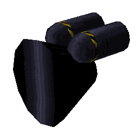
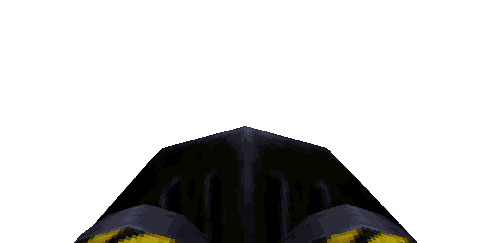

# Air Fist

#### `weapon_airgun`

### Normal Effects
Fires puff of air sending monsters and items flying. Useful for painlessly
rocket jumping as well.  Takes no ammo and fires as fast as every 0.5s, but
after 5 shots in quick succession, it needs 2.5s to reset. The push force
applied to the player is 300. The push affects all objects that are affected by
physical forces as well as players and monsters. This includes projectiles such
as rockets and also gibs and corpses. Missile style projectiles are merely
redirected away without a speed change while other objects have their velocity
modified. Maximum force against objects is 800 if directly in front, 500 if
behind the player. Force tapers off linearly with distance from the player up
to a range of 400 units away; reduces to a range of 320 underwater but damage
is doubled underwater to compensate. 3 bubbles are generated if underwater.

### Tome of Power Effects
Double damage against everything.  Double the impact force for the player only.
Impact force against other objects is not affected since this would be overly
unpredictable for the player and make it harder to eliminate all enemies.

### Stats Table

|Attribute                     |Value                          |
|:-----------------------------|:------------------------------|
|Entity                        |weapon_airgun                  |
|Source Mod                    |AirFist, Keep for pickup       |
|Provides                      |No ammo                        |
|Ammo Usage                    |None                           |
|Direct Impulse                |47                             |
|Weapon Slot                   |2                              |
|Normal Damage                 |% of 400 range * 20            |
|Alternate Damage 1            |% of 320 range * 40 underwater |
|Tome of Power Damage          |40                             |
|Tome of Power Alternate Damage|80                             |

|Pickup|View Model Normal|
|:---:|:---:|
||

-------------------------------------------------------------------------------
Book table of contents: [Weapons](3.0-Weapons.md)
 

Tome table of contents: [Introduction](1.0-Introduction.md)