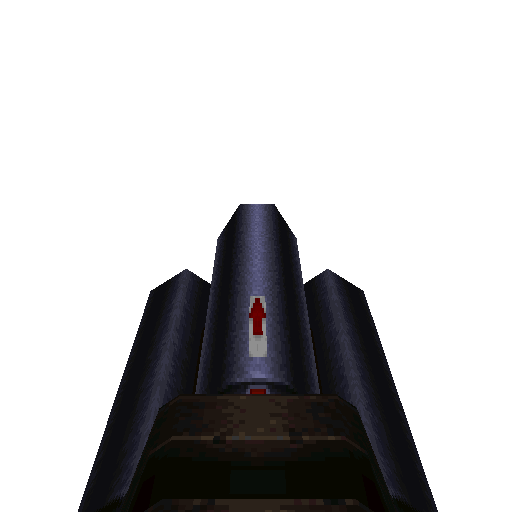

# Lava Super Nailgun

#### `weapon_lava_super_nailgun`

### Normal Effects
Lava variant of the Perforator.  Fires red hot nails that pierce armor.  Weapon
causes fire damage so certain monsters have resistance to fire damage.  Only 
does 18 damage against players.  Added weapon pickup model which wasn't
originally in Rogue.

### Tome of Power Effects
Changes to hitscan with double rate of fire.  Impact effects toss small flame
embers and have 100% chance of setting hit enemies on fire.

Fire applies 4 damage every second for a total time of damage / 4.  Then does
3, 2, 1 damage for 3 seconds as it fizzles out.

### Stats Table

|Attribute                     |Value                          |
|:-----------------------------|:------------------------------|
|Entity                        |`weapon_lava_super_nailgun`    |
|Source Mod                    |Rogue, Keep for pickup model   |
|Provides                      |30 Lava Nails                  |
|Ammo Usage                    |2 Lava Nails                   |
|Direct Impulse                |61                             |
|Weapon Slot                   |5                              |
|Normal Damage                 |30                             |
|Alternate Damage 1            |                               |
|Tome of Power Damage          |                               |
|Tome of Power Alternate Damage|                               |

|Pickup|View Model Normal|
|:---:|:---:|
||

-------------------------------------------------------------------------------
Book table of contents: [Weapons](3.0-Weapons.md)
 

Tome table of contents: [Introduction](1.0-Introduction.md)