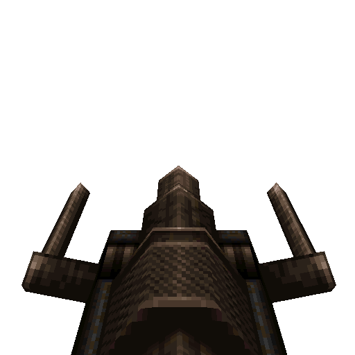

# Thunderbolt

#### `weapon_lightning`

### Normal Effects
Fires a continuous stream of lightning.  Discharging in the water causes damage
in a 35 * cells radius with 35 * cells damage, then drains cells to 0. Also
known informally as the "Lightning Gun".

Namesake of the "Lightning Gun Effect" trope:  The most powerful weapon gets
used the least because players will always want to save it just in case.

### Tome of Power Effects
Double damage and throws sparks.

### Stats Table

|Attribute                     |Value                          |
|:-----------------------------|:------------------------------|
|Entity                        |weapon_lightning               |
|Source Mod                    |ID1                            |
|Provides                      |15 Cells                       |
|Ammo Usage                    |1 Cell                         |
|Direct Impulse                |8                              |
|Weapon Slot                   |8                              |
|Normal Damage                 |30 every 0.1 seconds           |
|Alternate Damage 1            |                               |
|Tome of Power Damage          |60 every 0.1 seconds           |
|Tome of Power Alternate Damage|                               |

|Pickup|View Model Normal|
|:---:|:---:|
||

-------------------------------------------------------------------------------
Book table of contents: [Weapons](3.0-Weapons.md)
 

Tome table of contents: [Introduction](1.0-Introduction.md)