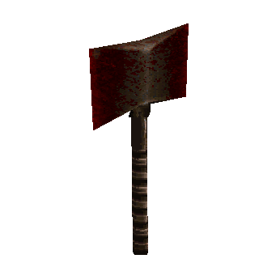
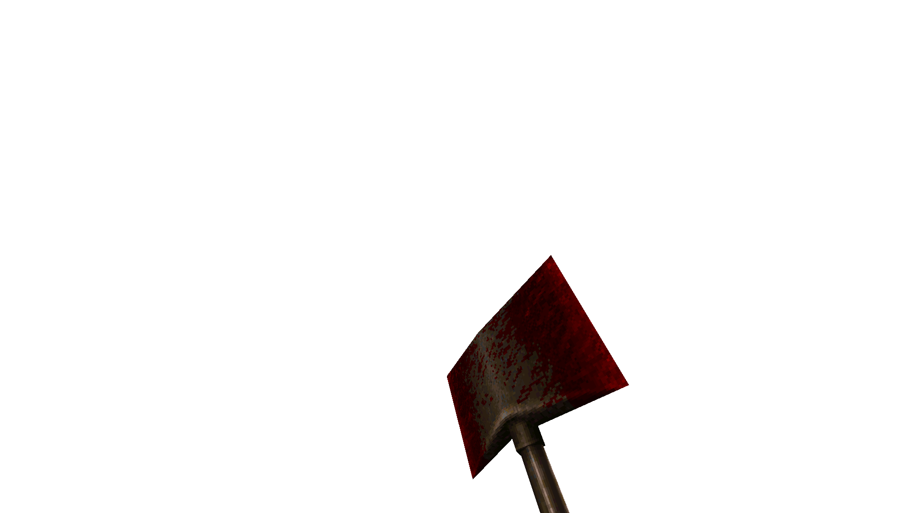
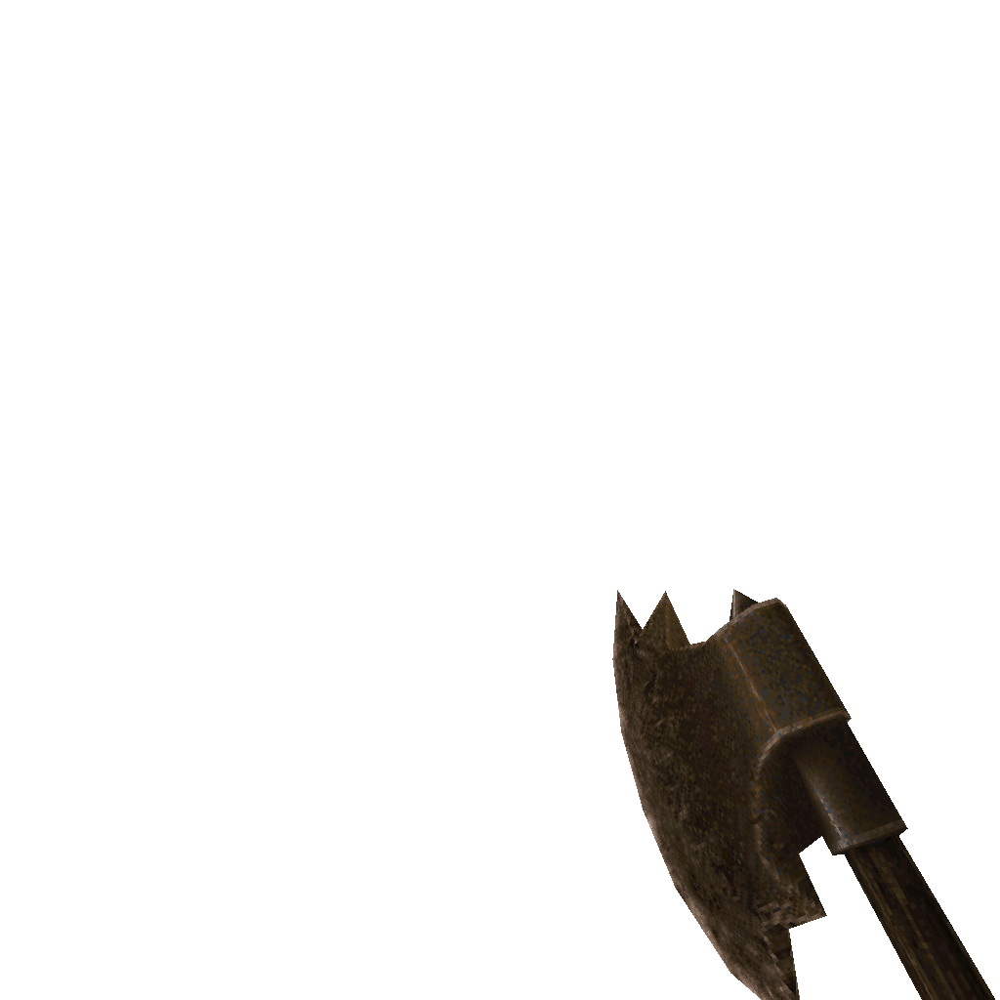

# Axe

#### `weapon_axe`

### Normal Effects
Weakest weapon. Simple axe with a few different swing angles. Possible to
change visual appearance from ID1 axe model to AD axe by setting `useold_axe`
to 1 in worldspawn. The AD axe will better match the shadow axe upgrade. See
the [Shadow Axe](3.32-weapon_upgrade_axe.md).  Guarantees that enemies who have
longer pain animations will always go into the longer animations enabling
higher chance of player to land more hits; this aids in axe only map starts or
maps with low ammo.

### Tome of Power Effects
Double damage and guarateed to gib zombies standing or laying. This is more
than simply upgrading to the shadow axe's behavior. Throws out extra gibs.

### Stats Table

|Attribute                     |Value                          |
|:-----------------------------|:------------------------------|
|Entity                        |weapon_axe                     |
|Source Mod                    |ID1, RRP for pickup            |
|Provides                      |No ammo                        |
|Ammo Usage                    |None                           |
|Direct Impulse                |1                              |
|Weapon Slot                   |1                              |
|Normal Damage                 |24                             |
|Alternate Damage 1            |                               |
|Tome of Power Damage          |48                             |
|Tome of Power Alternate Damage|120 to Zombie classgroup       |

|Pickup|View Model Normal|View Model AD|
|:---:|:---:|:---:|
|||

-------------------------------------------------------------------------------
Book table of contents: [Weapons](3.0-Weapons.md)
 

Tome table of contents: [Introduction](1.0-Introduction.md)