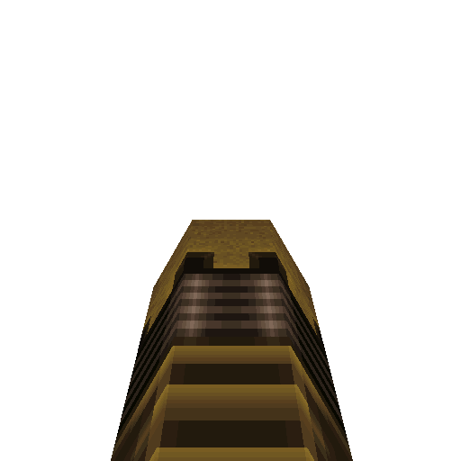

# Laser Blaster

#### `weapon_blaster`

### Normal Effects
Replaces shotgun on pickup.  Does same damage as shotgun but shoots a laser
projectile.  Lasers ricochet off walls up to 3 times but lose 10% damage with
each ricochet with a 15% chance of not ricocheting.

### Tome of Power Effects
Double damage and flings out sparks.

### Stats Table

|Attribute                     |Value                          |
|:-----------------------------|:------------------------------|
|Entity                        |weapon_blaster                 |
|Source Mod                    |Drake                          |
|Provides                      |25 Shells                      |
|Ammo Usage                    |1 Shell                        |
|Direct Impulse                |2                              |
|Weapon Slot                   |2                              |
|Normal Damage                 |24                             |
|Alternate Damage 1            |                               |
|Tome of Power Damage          |48                             |
|Tome of Power Alternate Damage|                               |

|Pickup|View Model Normal|
|:---:|:---:|
||

-------------------------------------------------------------------------------
Book table of contents: [Weapons](3.0-Weapons.md)
 

Tome table of contents: [Introduction](1.0-Introduction.md)