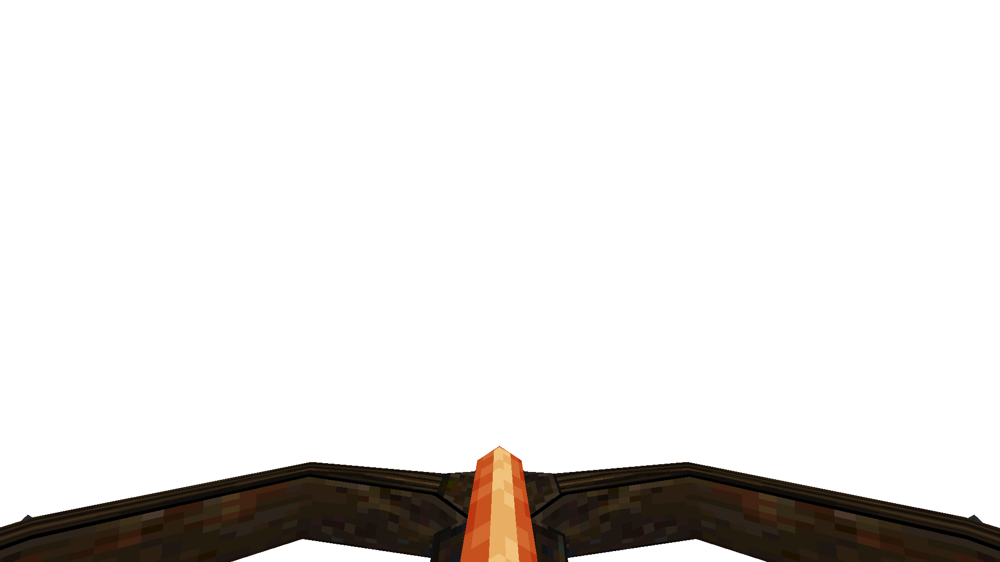
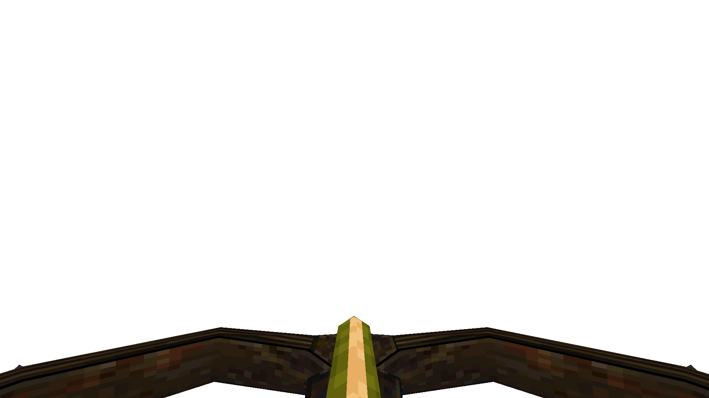

# Riot Controller

#### `weapon_airgun`

### Normal Effects
Faster firing double barreled shotgun.  Fires two shot in rapid succession for
each trigger pull.  Drum fed allows for rapidly refilling the chambers for
follow-up shots. Replaces the standard double-barreled shotgun.

### Tome of Power Effects
Fires explosive shells that do double damage.  Gibs zombies if more than 5
pellets hit.

### Stats Table

|Attribute                     |Value                          |
|:-----------------------------|:------------------------------|
|Entity                        |weapon_zershot                 |
|Source Mod                    |Zerstorer                      |
|Provides                      |No ammo                        |
|Ammo Usage                    |None                           |
|Direct Impulse                |47                             |
|Weapon Slot                   |2                              |
|Normal Damage                 |% of 400 range * 20            |
|Alternate Damage 1            |% of 320 range * 40 underwater |
|Tome of Power Damage          |40                             |
|Tome of Power Alternate Damage|80                             |

|Pickup|View Model Normal|View Model Poison|
|:---:|:---:|:---:|
|||

-------------------------------------------------------------------------------
Book table of contents: [Weapons](3.0-Weapons.md)
 

Tome table of contents: [Introduction](1.0-Introduction.md)