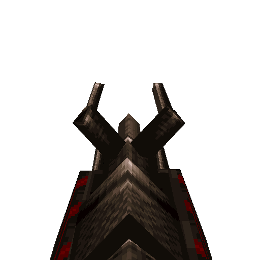

# Chain Lightning Gun

#### `weapon_chain_lightning`

### Normal Effects
Fires large shaft of lightning that splits between nearby enemies, damaging
all at once, but uses cells very rapidly.  Discharging in the water drains all
cells and causes damage in a 35 * cells radius with 35 * cells damage.
Also pierces anything in its path along the shaft. Damage is applied every
0.1s.

### Tome of Power Effects
Increased damage plus spark effects at impact.

### Stats Table

|Attribute                     |Value                          |
|:-----------------------------|:------------------------------|
|Entity                        |weapon_chain_lightning         |
|Source Mod                    |Zerstorer                      |
|Provides                      |15 Cells                       |
|Ammo Usage                    |1 Cell                         |
|Direct Impulse                |81                             |
|Weapon Slot                   |9                              |
|Normal Damage                 |30 every 0.1 seconds           |
|Alternate Damage 1            |n targets in 350 radius @ 20ea |
|Tome of Power Damage          |90 on initial impact           |
|Tome of Power Alternate Damage|n targets in 350 radius @ 60ea |

|Pickup|View Model Normal|
|:---:|:---:|
||

-------------------------------------------------------------------------------
Book table of contents: [Weapons](3.0-Weapons.md)
 

Tome table of contents: [Introduction](1.0-Introduction.md)