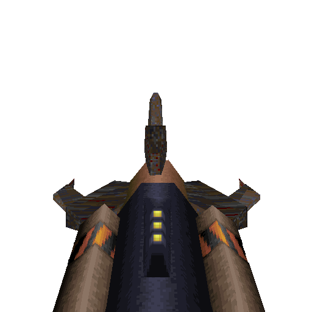

# Grapple Hook

#### `weapon_grapple`

### Normal Effects
Shoots out a hook with a cable.  Once the claw hits a solid surface, it pulls
the player to it.  Enemies are pulled instead if they are lower mass.  Enemies
are hurt by the claw.  If weapons are switched when the player has reached the
claw, player stays aloft. Useful to slow fall speed to prevent falling damage.

### Tome of Power Effects
Double pull speed and damage. Life leech heals player while damaging an enemy.
Tosses sparks out.

### Stats Table

|Attribute                     |Value                          |
|:-----------------------------|:------------------------------|
|Entity                        |weapon_grapple                 |
|Source Mod                    |Rogue / Drake                  |
|Provides                      |No ammo                        |
|Ammo Usage                    |None                           |
|Direct Impulse                |80                             |
|Weapon Slot                   |1                              |
|Normal Damage                 |10 initially, then 1 every 0.1s|
|Alternate Damage 1            |                               |
|Tome of Power Damage          |20 initially, then 2 every 0.1s|
|Tome of Power Alternate Damage|                               |

|Pickup|View Model Normal|
|:---:|:---:|
||

-------------------------------------------------------------------------------
Book table of contents: [Weapons](3.0-Weapons.md)
 

Tome table of contents: [Introduction](1.0-Introduction.md)