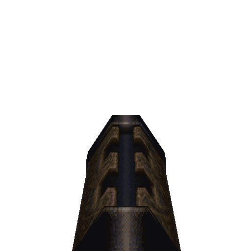

# Grenade Launcher

#### `weapon_grenadelauncher`

### Normal Effects
Lobs an explosive that bounces off surfaces explodes in 2.5 seconds or if it
impacts against a monster.

### Tome of Power Effects
Explodes on impact and creates a larger explosion with more damage. The
explosion can set things on fire.

### Stats Table

|Attribute                     |Value                          |
|:-----------------------------|:------------------------------|
|Entity                        |weapon_grenadelauncher         |
|Source Mod                    |ID1                            |
|Provides                      |10 Rockets                     |
|Ammo Usage                    |1 Rocket                       |
|Direct Impulse                |6                              |
|Weapon Slot                   |6                              |
|Normal Damage                 |100-120(120)                   |
|Alternate Damage 1            |                               |
|Tome of Power Damage          |160(160)                       |
|Tome of Power Alternate Damage|                               |

|Pickup|View Model Normal|
|:---:|:---:|
||

-------------------------------------------------------------------------------
Book table of contents: [Weapons](3.0-Weapons.md)
 

Tome table of contents: [Introduction](1.0-Introduction.md)