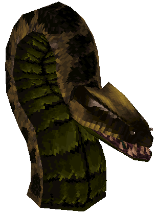

## monster_anac

|Name  |Desription|
|------|-------------|
|Entity|monster_anac|
|Mod   |Anaconda|
|Health|2500|
|Description|Large snake enemy.  Usually used as a boss, though is able to be used multiple times.  Intended to be trapped in a liquid (uses lava splash effect) with minimum depth of 32 and that has an alpha of 1.0 - dives when player is out of sight and the re-emerges later to surprise player.  Needs 368 units of overhead height above the liquid and 80 units of side clearance both to avoid model appearing to go through walls/ceiling.|

|Attack Type|Attack Name|Description|Damage|
|-----------|-----------|-----------|------|
|Projectile |Bite       |5 then 3 spikes emitted in a fan shape|30|
|^^|Vomit|14 emitted in a stream|10(30)|
|Death Effect|Gib Explosion|144 gibs that hurt on touch, 72 if in coop|(20)|