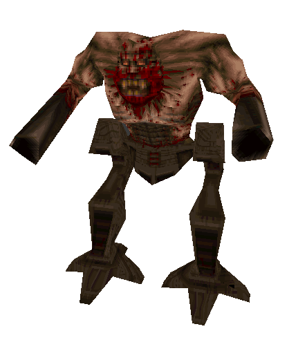

|Name  |Desription|
|------|-------------|
|Entity|monster_armagon|
|Source Mod|Hipnotic|
|Health|3000|
|Description|Large ugly gremlin-like monster combined with servo-mech legs.  Top half explodes on death and leaves behind non-solid legs.  Death explosions do not deal damage.  Attacks with different projectile attacks.  Stops randomly to fire barrage while planted in place.|

|Attack Type|Attack Name|Description|Damage|
|-----------|-----------|-----------|------|
|Projectile |Laser Barrage|Fires 10 lasers in succession while planted|18|
||Laser Barrage|Fires 2 lasers in succession while moving|18|
||Rocket Barrage|Fires 6 rockets in succession while planted|100-120(40)|
||Rocket Barrage|Fires 2 rockets in succession while moving|100-120(40)|
|Area Denial|Reuplse Knockback|Shoves the player away with 1500 velocity if they are within 200 units.|100-120(40)|