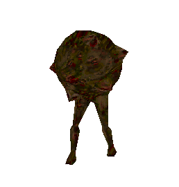
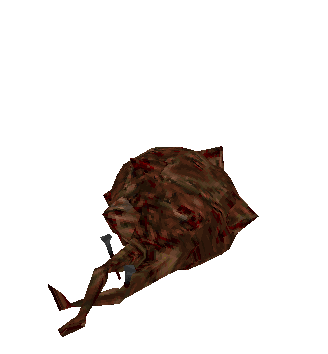
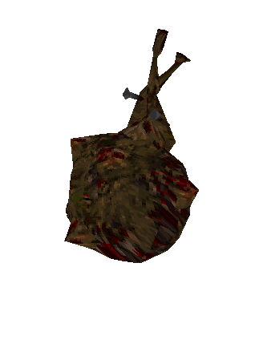

  

|Name  |Desription|
|------|-------------|
|Entity|monster_boil|
|Source Mod|Arcane Dimensions (AD)|
|Health||
|Pain Flinch||
|Description|Fleshy ball with legs.  Explodes when player is near it.  Can be able to walk around or start hanging on a wall or staked to the ground laying down.  Typically mappers set these up with breakables nearby and around and under them for maximum effect.|

|Attack Type|Attack Name|Description|Damage|
|-----------|-----------|-----------|------|
||||