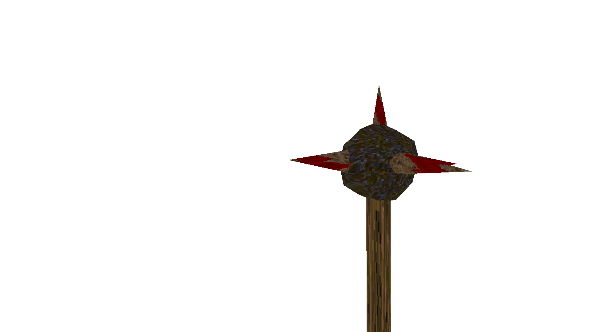

### `weapon_mace`

### Normal Effects
Attacks with a melee swing.  When off the ground, the first swipe will lunge
forward and up.  Lunging causes 25 damage on touch.  Gibs zombies.

The attack does radius damage to all entities within a 80 radius from a point
35 units in front of the player and 18 units below the player's eyes.

### Tome of Power Effects
Double damage.

### Stats Table

|Attribute                     |Value         |
|:-----------------------------|:-------------|
|Entity                        |weapon_mace   |
|Source Mod                    |Arms of Asgard|
|Provides                      |              |
|Ammo Usage                    |              |
|Direct Impulse                |              |
|Weapon Slot                   |1             |
|Normal Damage                 |45            |
|Alternate Damage 1            |25 on touch   |
|Tome of Power Damage          |90            |
|Tome of Power Alternate Damage|              |

|Pickup|View Model Normal|
|:---:|:---:|
||