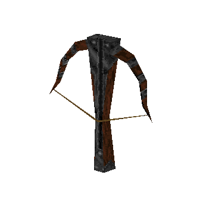

### `weapon_buriza`

### Normal Effects
Powerful crossbow that shoots bolts that cause cold damage to enemies. Freezes
enemies if they die from damage by the bolt.  All bolts are piercing and go
straight through any number of enemies.

#### Freezing
Frozen enemies immediately freeze at their current animation frame, gain alpha
of 0.6, 

### Tome of Power Effects
Fires 3 bolts out in a fan for the same ammo cost of 1.

### Stats Table

|Attribute                     |Value                          |
|:-----------------------------|:------------------------------|
|Entity                        |weapon_buriza                  |
|Source Mod                    |Drake                          |
|Provides                      |8 Bolts                        |
|Ammo Usage                    |1 Bolt                         |
|Direct Impulse                |47                             |
|Weapon Slot                   |2                              |
|Normal Damage                 |100(60)                        |
|Alternate Damage 1            |                               |
|Tome of Power Damage          |                               |
|Tome of Power Alternate Damage|                               |

|Pickup|View Model Normal|
|:---:|:---:|
||

-------------------------------------------------------------------------------
Book table of contents: [Weapons](3.0-Weapons.md)
 

Tome table of contents: [Introduction](1.0-Introduction.md)