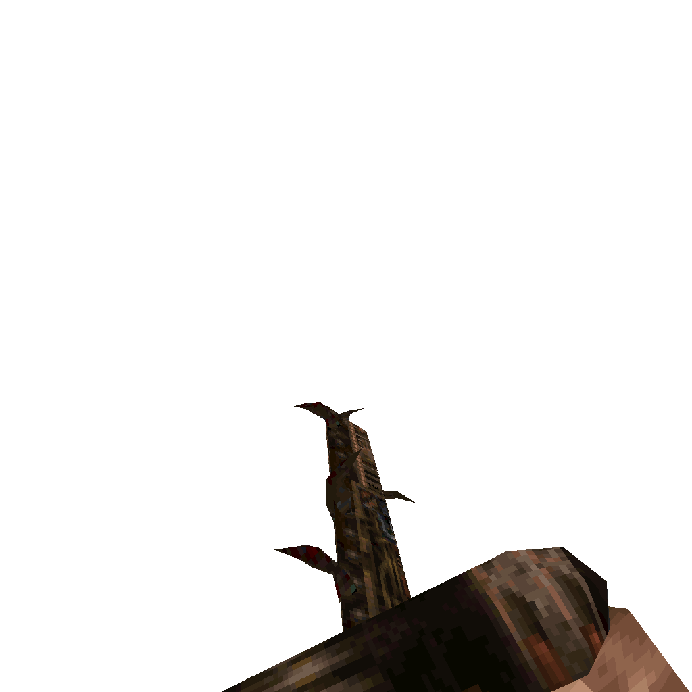

### `weapon_chainsaw`

### Normal Effects
High speed melee weapon that can gib zombies and most everything else. Takes no
ammo and can be ran constantly.

### Tome of Power Effects
Double damage. Flings gibs off of hit enemies that are flung so hard as to
cause damage to other enemies nearby. Randomly tosses a painful gib out in
front of player at any time.

### Stats Table

|Attribute                     |Value                          |
|:-----------------------------|:------------------------------|
|Entity                        |weapon_chainsaw                |
|Source Mod                    |Zerstorer                      |
|Provides                      |No ammo                        |
|Ammo Usage                    |None                           |
|Direct Impulse                |1                              |
|Weapon Slot                   |1                              |
|Normal Damage                 |40 every 0.2s                  |
|Alternate Damage 1            |                               |
|Tome of Power Damage          |80 every 0.2s, flung gibs 20ea |
|Tome of Power Alternate Damage|                               |

|Pickup|View Model Normal|View Model Zerstorer|
|:---:|:---:|:---:|
|||

-------------------------------------------------------------------------------
Book table of contents: [Weapons](3.0-Weapons.md)
 

Tome table of contents: [Introduction](1.0-Introduction.md)