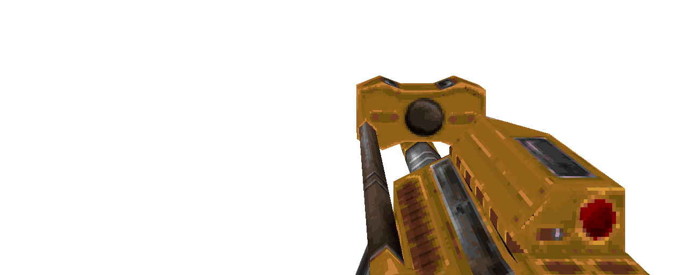

### `weapon_flak`

### Normal Effects
Launches an arcing explosive projectile. Impact causes radius explosion damage,
and launches 30 pieces of flak shrapnel in all diractions.

### Tome of Power Effects
Hitscan instead of projectile.

### Stats Table

|Attribute                     |Value                          |
|:-----------------------------|:------------------------------|
|Entity                        |weapon_flak                    |
|Source Mod                    |Arms of Asgard (AoA)           |
|Provides                      |60 Nails, 20 Rockets (7 shots) |
|Ammo Usage                    |8 Nails, 2 Rockets             |
|Direct Impulse                |85                             |
|Weapon Slot                   |8                              |
|Normal Damage                 |125(125), 30 @ 5ea             |
|Alternate Damage 1            |                               |
|Tome of Power Damage          |                               |
|Tome of Power Alternate Damage|                               |

|Pickup|View Model Normal|
|:---:|:---:|
||

-------------------------------------------------------------------------------
Book table of contents: [Weapons](3.0-Weapons.md)
 

Tome table of contents: [Introduction](1.0-Introduction.md)