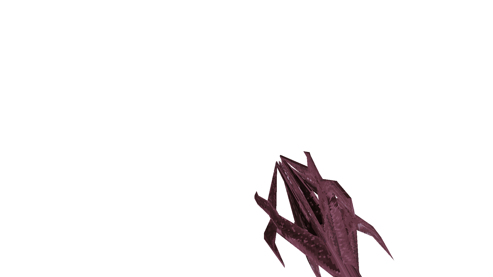

### `weapon_gungnir`

### Normal Effects
Melee works without ammo, 1 voidshard adds the projectile, and the dive attack
does radius damage. Attacking underwater provides a significant speed boost
forward.

### Tome of Power Effects
Summons the Eye of Odin, a vortex which pulls in projectiles, monsters, and
players, and strikes them with lightning.

### Stats Table

|Attribute                     |Value                          |
|:-----------------------------|:------------------------------|
|Entity                        |weapon_gungnir                 |
|Source Mod                    |Arms of Asgard                 |
|Provides                      |30 Void Shards                 |
|Ammo Usage                    |Void Shards                    |
|Direct Impulse                |86                             |
|Weapon Slot                   |0                              |
|Normal Damage                 |40, dive 60-120ea in 350 radius|
|Alternate Damage 1            |                               |
|Tome of Power Damage          |                               |
|Tome of Power Alternate Damage|                               |

|Pickup|View Model Normal|
|:---:|:---:|
||

-------------------------------------------------------------------------------
Book table of contents: [Weapons](3.0-Weapons.md)
 

Tome table of contents: [Introduction](1.0-Introduction.md)