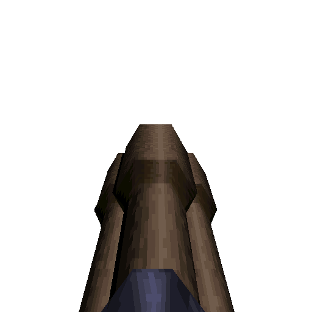

### `weapon_laser_gun`

### Normal Effects
Fires lasers in an alternating pattern of 2 blasts at once then 1 blast.
Lasers ricochet off walls up to 3 times but lose 10% damage with each ricochet
with a 15% chance of not ricocheting.  Very rapid fire. Hipnotic originally 
only gave 15 cells with pickup; increased since 15 cells would run out very
rapidly in cell starved maps.

### Tome of Power Effects
Double damage and flings out sparks.

### Stats Table

|Attribute                     |Value                          |
|:-----------------------------|:------------------------------|
|Entity                        |weapon_laser_gun               |
|Source Mod                    |Hipnotic                       |
|Provides                      |30 Cells                       |
|Ammo Usage                    |1 Cell                         |
|Direct Impulse                |75                             |
|Weapon Slot                   |9                              |
|Normal Damage                 |18                             |
|Alternate Damage 1            |                               |
|Tome of Power Damage          |36                             |
|Tome of Power Alternate Damage|                               |

|Pickup|View Model Normal|
|:---:|:---:|
||

-------------------------------------------------------------------------------
Book table of contents: [Weapons](3.0-Weapons.md)
 

Tome table of contents: [Introduction](1.0-Introduction.md)