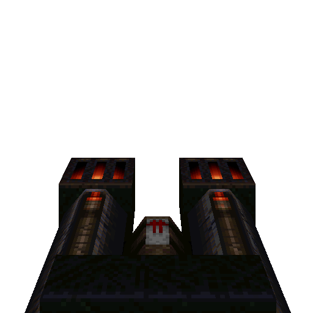

### `weapon_lava_nailgun`

### Normal Effects
Lava variant of the Nailgun.  Fires red hot nails that pierce armor.  Weapon
causes fire damage so certain monsters have resistance to fire damage.  Only
does 9 damage against players.  Added weapon pickup model which wasn't
originally in Rogue.

### Tome of Power Effects
Changes to hitscan with double rate of fire.  Impact effects toss small flame
embers and have 100% chance of setting hit enemies on fire.

Fire applies 4 damage every second for a total time of damage / 4.  Then does
3, 2, 1 damage for 3 seconds as it fizzles out.

### Stats Table

|Attribute                     |Value                          |
|:-----------------------------|:------------------------------|
|Entity                        |weapon_lava_nailgun            |
|Source Mod                    |Rogue, Keep for pickup model   |
|Provides                      |30 Lava Nails                  |
|Ammo Usage                    |1 Lava Nail                    |
|Direct Impulse                |60                             |
|Weapon Slot                   |4                              |
|Normal Damage                 |15                             |
|Alternate Damage 1            |                               |
|Tome of Power Damage          |                               |
|Tome of Power Alternate Damage|                               |

|Pickup|View Model Normal|
|:---:|:---:|
||

-------------------------------------------------------------------------------
Book table of contents: [Weapons](3.0-Weapons.md)
 

Tome table of contents: [Introduction](1.0-Introduction.md)