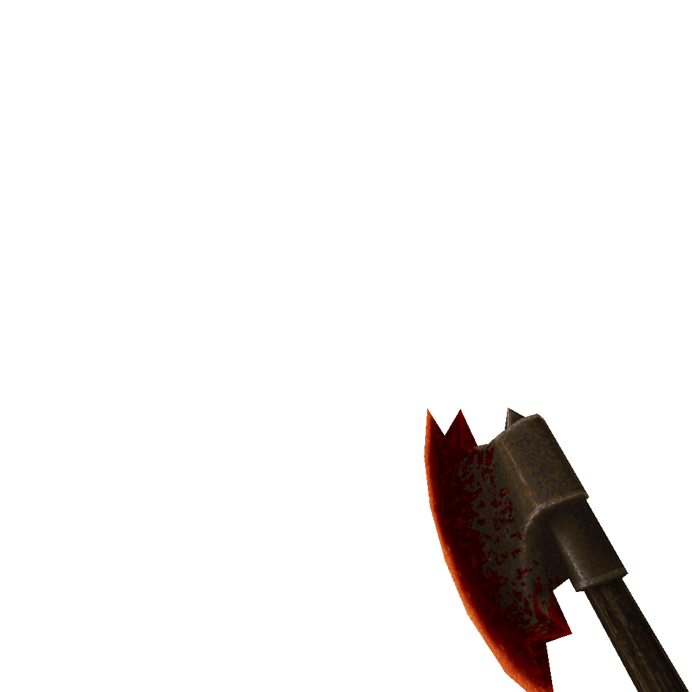

### `weapon_upgrade_axe`

### Normal Effects
Replaces the normal axe.  Does more damage and is capable of gibbing corpses,
notably useful for killing downed or lying zombies.

### Tome of Power Effects
Double damage and guarateed to gib zombies standing or laying. Throws out extra
gibs.

### Stats Table

|Attribute                     |Value                          |
|:-----------------------------|:------------------------------|
|Entity                        |weapon_upgrade_axe             |
|Source Mod                    |Arcane Dimensions (AD)         |
|Provides                      |No ammo                        |
|Ammo Usage                    |None                           |
|Direct Impulse                |1                              |
|Weapon Slot                   |1                              |
|Normal Damage                 |56                             |
|Alternate Damage 1            |                               |
|Tome of Power Damage          |112                            |
|Tome of Power Alternate Damage|120 to Zombie classgroup       |

|Pickup|View Model Normal|
|:---:|:---:|
||

-------------------------------------------------------------------------------
Book table of contents: [Weapons](3.0-Weapons.md)
 

Tome table of contents: [Introduction](1.0-Introduction.md)